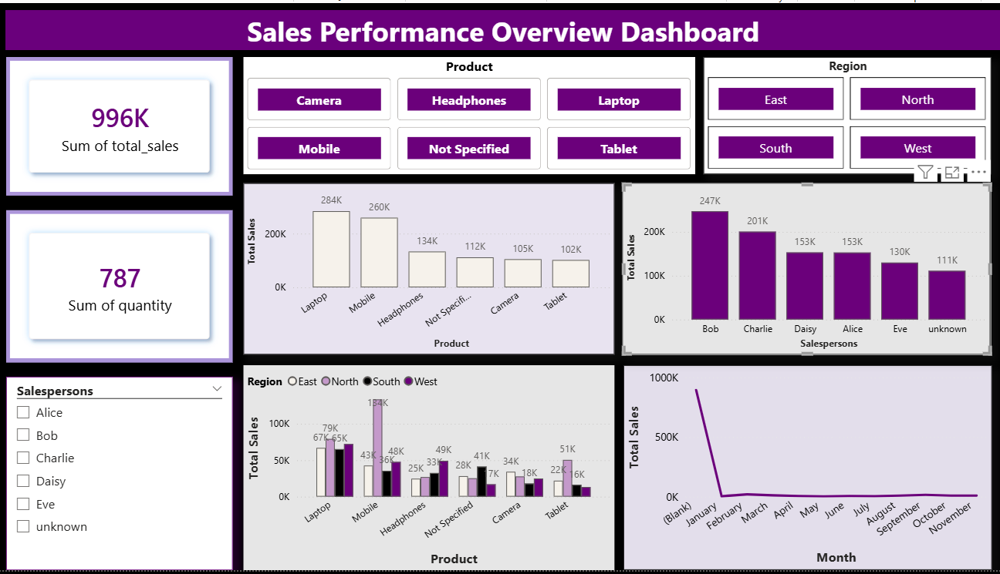

#  Sales Data Analysis & Power BI Dashboard

This project presents a complete data analytics workflow—from cleaning raw sales data in Python to building an interactive Power BI dashboard for business insights.

---

##  Project Structure

All project files are linked below:

- **Raw Dataset:**  
  [raw_sales_dataset.csv](raw_sales_dataset.csv)

- **Python Cleaning Script:**  
  [sales_data_cleaning.py](sales_data_cleaning.py)

- **Cleaned Dataset:**  
  [cleaned_dataset.csv](cleaned_dataset.csv)

- **Power BI Dashboard:**  
  [sales_dashboard.pbix](sales_dashboard.pbix)

---

##  Project Overview

The objective of this project is to clean and transform a messy sales dataset, then visualize key insights through a Power BI dashboard.  
The analysis covers:

- Overall sales performance  
- Regional trends  
- Product-level insights  
- Salesperson performance  
- Monthly sales patterns  

---

## 🧹 Data Cleaning (Python Workflow)

The raw data had issues such as:

- Missing and unknown values  
- Duplicate entries  
- Incorrect data types  
- Unstandardized text fields  

Using **Pandas**, these issues were systematically cleaned and exported as a finalized dataset.

- Cleaned dataset:  
  [cleaned_dataset.csv](cleaned_dataset.csv)

- Full cleaning script:  
  [sales_data_cleaning.py](sales_data_cleaning.py)

---

## Power BI Dashboard Highlights

The dashboard includes interactive features and clear visual summaries:

### ✔ Filters (Slicers)
- Region  
- Salesperson  
- Product  

###  Key Metrics
- Total Sales  
- Quantity Sold  

###  Visuals
- Total Sales by Region (Clustered Column Chart)  
- Total Sales by Product (Column Chart)  
- Total Sales by Salesperson (Column Chart)  
- Monthly Sales Trend (Line Chart)  

Dashboard file:  
[sales_dashboard.pbix](sales_dashboard.pbix)

---

##  Tools Used
- Python (Pandas)  
- Power BI  
- Visual Studio Code  
- Git & GitHub  

---

###  Dashboard Preview  

The dashboard includes interactive features and clear visual summaries:

##  Conclusion

This project demonstrates how raw, unstructured data can be transformed into clear, actionable insights.  
Through effective cleaning and visualization, the dashboard provides a strong foundation for understanding sales trends and supporting data-driven decision-making.

---
